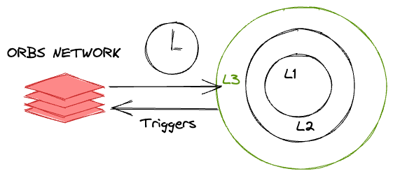

# orbs-v3 overview

Orbs v3 - layer3 brings two main features to its decentralized network:

## orbs-lambda - Decentralized Serverless Cloud Function
Event driven, serverless and decentralized computing solution, similar in concept to AWS Lambda - but decentralized.

Write your cloud function in regular JavaScript, without any blockchain specific knowledge. Code can utilize familiar node.js libraries such as node-fetch. Select a trigger for execution, like running on a new L1/L2 block or on a new L1/L2 on-chain event, and deploy. Your function will be executed on dozens of independent decentralized validator nodes.

orbs-lambda is like a decentralized AWS lambda
It gives developers a way to install simple JS code to interact with L1+L2 contracts which can be trigger upon different type of events.
Some events could fire upon L1+L2 events, Time based crontab like events or others.

## orbs-vm - Orbs VM - Decentralized Docker-Based Virtual Machine

Dedicated decentralized virtual machine, similar in concept to AWS EC2 - but decentralized.

Implement your custom service as a Docker container, without any blockchain specific knowledge. Use any programming language you like, such as Go, C++, Rust, JavaScript, Java, Python and more. Deploy your container to have it executed as an always-on service on dozens of independent decentralized validator nodes.

Instead of writing a complicated and very limited, network specific *smart contract*, you can now develop a full application running in a docker container yet in a decentralized manner, with full interaction with any of the layer 1 and layer 2 networks

Take your dapp, complicated and cetralized backend and make it decentralised with orbs-vm
