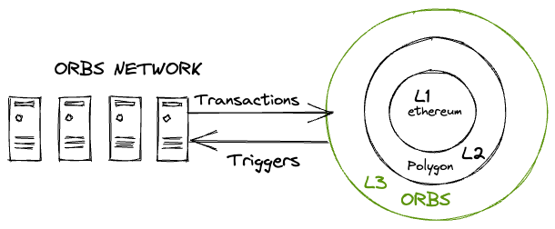

# ORBS-V3
## What is ORBS?
ORBS is an open, decentralized and public blockchain infrastructure executed by a secure network of permissionless validators using Proof-of-Stake (PoS) consensus.

ORBS’ unique features, designed for interoperability with EVM and non-EVM blockchains, together with its decentralized network of nodes, allow it to be set up as a separate decentralized execution layer operating between the base blockchain layer and application layer.

ORBS works in conjunction with existing L1 and L2 solutions, such as Ethereum, Polygon, BNB Chain, Avalanche etc., as part of a tiered blockchain stack. A dApp does not need to move its liquidity onto a different chain in order to utilize ORBS execution services. ORBS acts as a “Decentralized Backend”, enhancing the capabilities of EVM smart contracts and opening up a whole new spectrum of possibilities for Web 3.0, DeFi, NFTs and GameFi.

## Pain and Solution
As the industry evolves, DeFi and Web 3.0 protocols and applications are becoming more and more complex. Yet, while the protocols and applications are evolving, smart contracts are still inherently limited in nature as they are sandboxed by design. For example, smart contracts cannot trigger future actions at arbitrary conditions or times since state changes require something external to the contract to initiate a transaction. Another example is a smart contract’s inability to query data external to the chain, a limitation known as the “oracle problem”. This means that a lot of the new breeds of DeFi and Web 3.0 projects may still need to execute a significant portion of their functionality using centralized backend infrastructure.

It is not difficult to explain why centralized backend infrastructure is not optimal for DeFi and Web 3.0 projects, as it contradicts the trustless ideal of the industry. Centralization poses security and robustness risks due to the existence of a single point of failure. Centralized infrastructure exposes project participants to malicious behavior, increases liability and is usually expensive and difficult to maintain.

This is where ORBS L3 comes in. The ORBS Network operates as a decentralized serverless cloud allowing developers to extend smart contracts with L3 decentralized backend services. These are deployed to be executed by ORBS PoS validators (known as Guardians) and relieve projects of the need to rely on centralized backend solutions. Such interactions may be simplistic, such as sending transactions at a specific time or upon a specific event, or more complex, with logic in high level languages like JavaScript and Python.

> More on ORBS-V3 Layer3 [here](https://www.orbs.com/network)
## ORBS-V3 - Layer3 New features

ORBS-V3 - layer3, brings two main features to its decentralized network: ORBS-VM & ORBS-Lambda. In the following docs you will be guided how to set up your own ORBS-VM or ORBS-Lambda schema.

### ORBS VM - Decentralized Docker-Based Virtual Machine

Dedicated decentralized virtual machine, similar in concept to AWS EC2 - but decentralized.

Implement your custom service as a Docker container, without any blockchain specific knowledge. Use any programming language you like, such as Go, C++, Rust, JavaScript, Java, Python and more. Deploy your container to have it executed as an always-on service on dozens of independent decentralized validator nodes.

Instead of writing a complicated and very limited, network specific *smart contract*, you can now develop a full application running in a docker container yet in a decentralized manner, with full interaction with any of the layer 1 and layer 2 networks

Take your dapp, complicated and cetralized backend and make it decentralised.
get started with [ORBS-VM](./orbs-vm/get-started.md)

### ORBS-Lambda - Decentralized Serverless Cloud Function
ORBS-Lambda is in fact an instance of ORBS-VM running on ORBS-V3 network
It is an event driven, serverless and decentralized computing solution, similar in concept to AWS Lambda - but decentralized.

Write your cloud function in regular JavaScript, without any blockchain specific knowledge. Code can utilize familiar node.js libraries such as node-fetch. Select a trigger for execution, like running on a new L1/L2 block or on a new L1/L2 on-chain event, and deploy. Your function will be executed on dozens of independent decentralized validator nodes.

ORBS-Lambda is like a decentralized AWS lambda
It gives developers a way to install simple JS code (schema) to interact with L1+L2 contracts which can be trigger upon different type of events.
Some events could fire upon L1+L2 events, Time based crontab like events or others.

Get started with [ORBS-Lambda](./orbs-lambda/get-started.md)