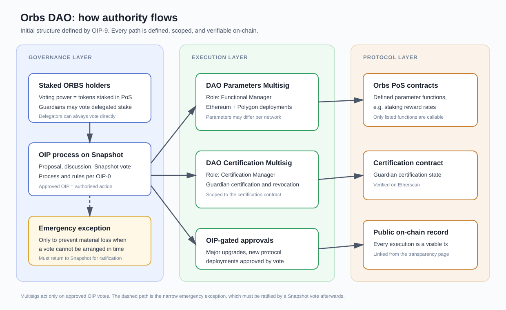
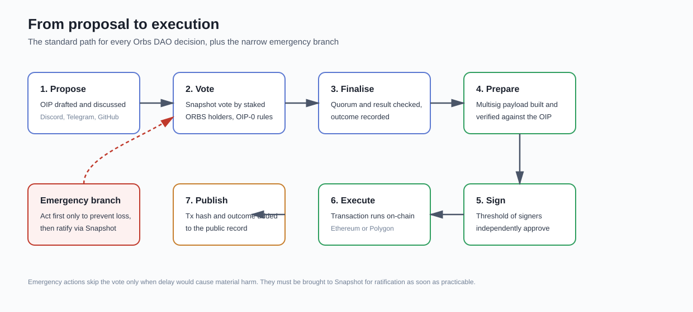

# Orbs DAO

The Orbs DAO is the collective of staked ORBS token holders who govern defined areas of the Orbs protocol. Established through [OIP-9](https://github.com/orbs-network/OIPs/issues/10), the DAO exercises its authority through community votes and an on-chain multisig wallet with hardcoded roles in the Orbs smart contracts.

This page documents the full governance system: who votes, what the DAO controls, which wallet executes decisions, and how to verify all of it on-chain.

***

## Architecture

Orbs governance is organised in three layers, each with a distinct responsibility in the lifecycle of a decision:

* **Governance layer:** Voting power resides with staked ORBS holders. Proposals are submitted and voted on through the [Orbs Snapshot space](https://snapshot.box/#/s:orbs-network.eth), following the rules set out in [OIP-0](https://github.com/orbs-network/OIPs/issues/1).
* **Execution layer:** A single DAO multisig wallet carries approved decisions on-chain. It holds the protocol roles and a defined set of callable functions, and acts only on OIP decisions approved by Snapshot vote.
* **Protocol layer:** The Orbs PoS smart contracts and the Certification contract, where DAO decisions take effect as verifiable transactions.

<figure><figcaption>
How authority flows through the three layers of Orbs governance.
</figcaption></figure>

## Voting

### Voting power

Voting power belongs to ORBS tokens staked in the Orbs Proof-of-Stake contract at each proposal's snapshot block. Changes made after the snapshot block, such as new staking or a change of delegated Guardian, are not reflected in that proposal's voting power.

### Guardians and delegators

By default, Guardians are entitled to vote on behalf of their entire delegated stake. Any delegator who prefers to vote independently is permitted to do so by casting their own vote. Voting is gasless and occurs off-chain through signed messages that can be verified on-chain if necessary.

### Proposal rules

Proposals follow the OIP process defined in OIP-0:

* Ideas are incubated in community channels, then submitted as a draft OIP on GitHub
* OIP editors and the community review the draft until it is labelled Final
* Final proposals are voted on by the community of Orbs PoS participants on Snapshot
* Voting standards follow the defaults of the Orbs Snapshot space, unless the OIP specifies otherwise

The default of the Orbs Snapshot space provide that votes generally take place over 7 days with a quorum of 100M staked ORBS (roughly 10% of total stake), with abstentions counting toward quorum and voters able to change their vote until the window closed. If a different approach is proposed, the different timing and quorum will be stated in the proposal itself.

## DAO authority

At launch, the DAO governs four areas. Authority not listed here remains outside the DAO's initial mandate and can only be added through a future OIP vote.

### 1. Protocol parameters

The DAO Multisig is set as the **Functional Manager** in the Orbs PoS smart contract architecture. This grants the DAO control over defined protocol parameters, including PoS reward rates.

### 2. Guardian certification

The DAO Multisig is set as the **Certification Manager** on the [Certification contract](https://etherscan.io/address/0x8d2a2a4dbdf9c9d9dff72abc96a2751b70ab3011#code). This grants the DAO authority over Guardian certifications and revocations.

### 3. Major network upgrades

All major network upgrades, including the remaining Orbs V5 milestones and any future versions, require approval by an OIP vote.

### 4. New protocol deployments

Deployment of new protocols and product modules that utilise the Orbs network requires approval by an OIP vote.

### On-chain and off-chain authority

Not all of the DAO's authority is enforced by smart contracts today. Protocol parameters and Guardian certification are enforced on-chain through the multisig roles described below. Major network upgrades and new protocol deployments are governed off-chain: the multisig holds no control over these areas, and they are instead covered by a binding commitment that no such change will be made without an approved OIP vote. Our aspiration is for every area of DAO authority to eventually be enforced on-chain, but this is not yet feasible for all of them.

### Future expansion

The DAO's authority is designed to grow in stages. Future OIPs may expand it to areas such as protocol revenue, burn mechanisms, liquidity strategies, grants programs and tokenomics design. Each expansion requires its own community vote.

## The DAO multisig

The Orbs DAO lives on-chain as a single multisig wallet. It holds the protocol roles and a defined list of functions it can call, and takes action only to implement OIP decisions approved on Snapshot.

### DAO Multisig

* **Roles:** Functional Manager (Orbs PoS architecture) and Certification Manager (Certification contract)
* **Ethereum address:** [`0x95899d7be0eeee6Af05C4D4B90A66B3dd7Aa4369`](https://etherscan.io/address/0x95899d7be0eeee6Af05C4D4B90A66B3dd7Aa4369)
* **Polygon address:** [`0x95899d7be0eeee6Af05C4D4B90A66B3dd7Aa4369`](https://polygonscan.com/address/0x95899d7be0eeee6Af05C4D4B90A66B3dd7Aa4369)
* **Threshold:** 2-of-4
* **Controlled functions:** as Functional Manager, setting defined PoS protocol parameters, including staking reward rates; as Certification Manager, certifying and revoking Guardian certifications

### Owners

The multisig is operated in the initial phase by four Orbs team members. The owner addresses below can be independently verified against the multisig contract on both Ethereum and Polygon at any time.

| Owner address                                |
| -------------------------------------------- |
| `0x551ba5E928860FddE68Bf721730186d4dAC1F367` |
| `0xee36B237159459bbbae577908010bF1DE9662fB7` |
| `0xd53a0556d0C24c4Bd56f8b148bb750842Bc9ad4e` |
| `0x7f2F96597358458D6ac04b8562C6148FC61Fe47b` |

### Ownership transfer record

The transfer of protocol roles to the DAO multisig is recorded on-chain:

* Functional Manager transfer (Ethereum): [`0x5edff021…b51e70`](https://etherscan.io/tx/0x5edff02107905efe3a5fb1376802bee4a4c20f34ce8c15aed68dc95b03b51e70)
* Certification Manager transfer (Ethereum): [`0x35b27ac4…1da47f`](https://etherscan.io/tx/0x35b27ac4b5768a7b13a616d0655ba4d38b6e8b842680c711ebbd34c47e1da47f)
* Functional Manager transfer (Polygon): [`0xd4992323…50dc1c`](https://polygonscan.com/tx/0xd49923232e02c9afe4a34b35a6ab0aa9fcb3cf2eeb14e25f458311065d50dc1c)
* Certification Manager transfer (Polygon): [`0x8be0c9f5…59cf58`](https://polygonscan.com/tx/0x8be0c9f5369dd1ab02a5414e14a87c983736cd5bc33c0784d0bc989b2359cf58)

## From proposal to execution

Every DAO decision follows the same path:

1. **Propose.** An OIP is drafted and discussed with the community
2. **Vote.** Staked ORBS holders vote on Snapshot under the proposal's stated rules
3. **Finalise.** Quorum and result are confirmed and the outcome is recorded
4. **Prepare.** The multisig builds the transaction and verifies it against the approved OIP
5. **Sign.** The required threshold of signers independently review and approve
6. **Execute.** The transaction runs on-chain
7. **Publish.** The transaction hash and outcome are published

<figure><figcaption>
The proposal-to-execution lifecycle. The emergency branch always returns to a Snapshot ratification vote.
</figcaption></figure>

### Emergency actions

In an emergency where failing to act promptly risks financial loss or a material adverse effect on the project, and a Snapshot vote cannot be arranged in time, the Orbs core team may act first to the extent needed to mitigate the risk. Any such action must be brought to a Snapshot vote for ratification by DAO members as soon as practicable, together with a full explanation.

## Verifying the system

Everything on this page can be independently checked:

* **Multisig contract:** verified source code on Etherscan and Polygonscan
* **Owner set and threshold:** readable directly from the multisig contract
* **Protocol roles:** the Functional Manager and Certification Manager addresses are readable from the PoS and Certification contracts
* **Every execution:** a public transaction verifiable on Etherscan
* **Every decision:** a public vote on the Orbs Snapshot space

## Resources

* [OIP repository](https://github.com/orbs-network/OIPs)
* [OIP-0: Governance rules](https://github.com/orbs-network/OIPs/issues/1)
* [OIP-9: Establishing the Orbs DAO](https://github.com/orbs-network/OIPs/issues/10)
* [Orbs Snapshot space](https://snapshot.box/#/s:orbs-network.eth)
* [Orbs staking](https://staking.orbs.network/)
