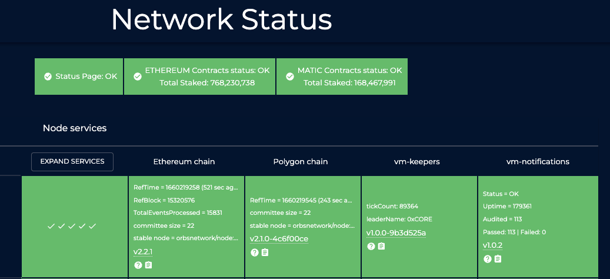

# status

## introduction



&#x20;All docker containers running on orbs network are montiored by [orbs status page](https://status.orbs.network/).

Each orbs-vm gets its on visual representation according to the `status.json` the vm exports.

Your orbs-vm should write its own `/status/status.json` every 5 minutes in order to be monitored, and for the HEALTHCHECK [descibed here](best-practice.md), to work properly.

## json format

```json
{
    "Error": "Human readable explanation of current error, field exists only if the status is erroneous.",
    "Status": "Human readable explanation of current status, field always exists.",
    "Timestamp": "2020-03-19T11:50:21.0846185Z",
    "Payload": {
        "Version": {
            "Semantic": "v1.3.1"
        },
        "CustomFieldsGoHere": 17,
        "MoreCustomFields": "any data type"
    },
    "config":{...}
}
```

### Error

* Human readable explanation of current error, field exists only if the status is erroneous.
* make sure to remove this field from the json in case the error has expired or not informative
* upon error, status page responds in yellow color for the orbs-vm representation box and shows text about the error.

### Status

* Human readable explanation of current status, field always exists.
* Use coma seperated strings to be used as a preview in the orbs-vm box on the status page.

### Timestamp

* Shows the latest write time of the file
* used by status to determind validity of a orbs-vm status

### Payload.Version.Semantic

* Shows which orbs-vm version, running on which node.

### config

* its a good to export whatever extenal config that is used by the orbs-vm instance for debug and monitorig puposes.

## json folder

`/opt/orbs/status/status.json` Since the working folder of the orbs-vm is `/opt/orbs`

you just need to add add `/status/status.json` to the working folder

e.g

```js
    writeFileSync('./status/status.json', JSON.stringify(myStatus));
```

legacy orbs-v2 service service can be found [here](https://github.com/orbs-network/orbs-spec/blob/ee181179ddf8ee57dc0b2bd1197a1b91054edd64/node-architecture/BOYAR.md)
